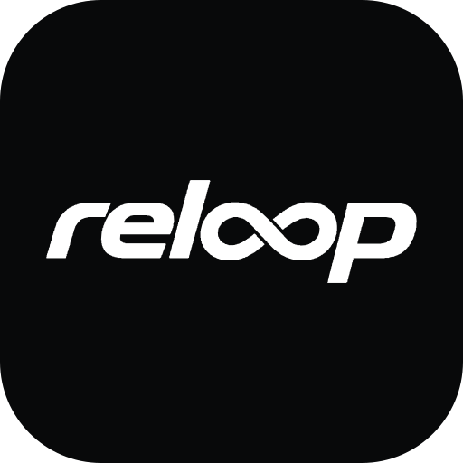
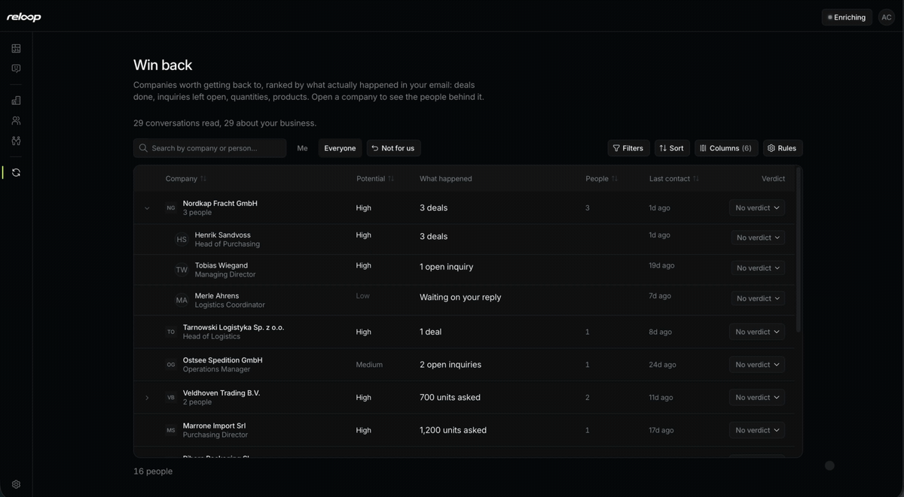
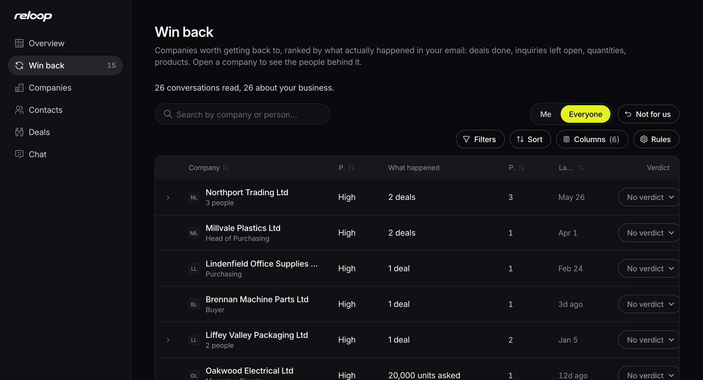
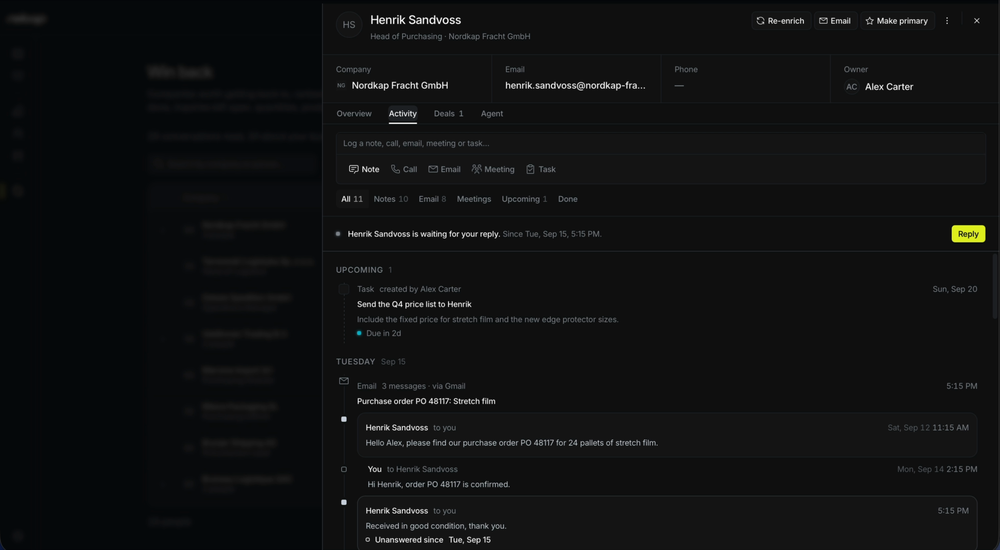
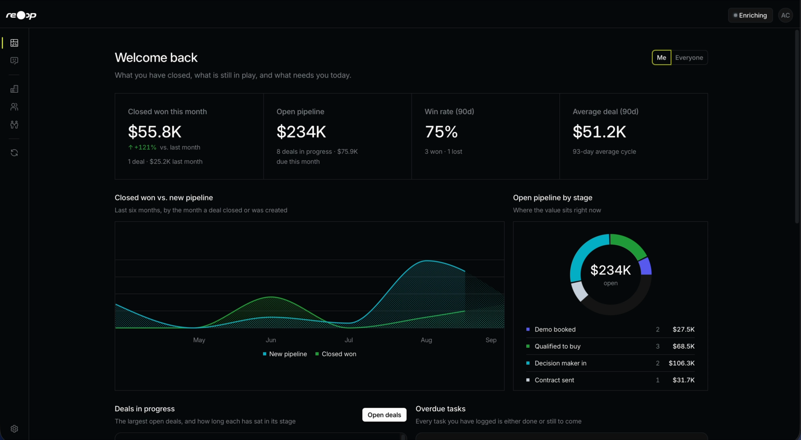

<p align="center">
  <br>
  <strong>Reloop CRM</strong><br>
  The open source CRM that reads your email history and tells you which past customers are worth winning back.
</p>

<p align="center">
  <a href="https://reloopcrm.com"><strong>reloopcrm.com</strong></a>
  &nbsp;·&nbsp;
  <a href="https://reloopcrm.com/get-started">Get started</a>
  &nbsp;·&nbsp;
  <a href="https://reloopcrm.com/docs">Docs</a>
  &nbsp;·&nbsp;
  <a href="https://github.com/reloopcrm/reloop/releases">Releases</a>
</p>

<p align="center">
  
</p>

<p align="center">
  
</p>

<p align="center">
  
</p>

<p align="center">
  
</p>

## What it does

Reloop CRM connects to your mailbox, reads every conversation and remembers what it was about: closed deals, open inquiries, quantities, products. From that it builds a list of people worth another try, ranked by facts instead of gut feeling.

- **Any mailbox.** IMAP, Google Workspace or Microsoft 365. The full history is read once, then kept in sync. You choose how far back when you connect the mailbox.
- **An agent reads along.** Every conversation gets a short summary and every message one line, so a thread is readable without opening a single email.
- **Win back.** Points from real business facts, and rules the agent sharpens from your own verdicts.
- **Learns your business.** Onboarding asks what you sell, the AI fills in the rest from your website and your mail.
- **Only contacts that matter.** Out of office replies, newsletter recipients who never answered and your own addresses stay out.
- **Bring your own AI.** An OpenRouter, OpenAI or Anthropic API key, or a ChatGPT subscription (experimental). Without one, the CRM works without AI.

## Self-host

You need a Linux server with Docker.

```bash
curl -fsSL https://reloopcrm.com/install.sh | sh
```

The script asks for your domain, your email and a password, then starts everything. The full guide is in [`docs/self-host.md`](./docs/self-host.md).

A hosted cloud version is coming later.

## Develop

Requirements: Bun, Node 24 for the agent, Postgres 17 (or Docker).

```bash
cp .env.example .env
bun install
docker compose up -d
bun run db:deploy
bun run dev
```

That starts the app on :3000, the API on :3001 and the agent on :2000. More in [`docs/setup.md`](./docs/setup.md).

| Folder | What it holds |
| --- | --- |
| `apps/app` | Web app, Next.js App Router |
| `apps/api` | API, NestJS with tRPC and Prisma |
| `apps/agent` | The agent that reads, researches and tidies up |
| `packages/db` | Data model and shared queries |
| `packages/ui` | Every UI building block |
| `packages/validation` | Shapes that cross package boundaries |

Rules for contributors are in [`AGENTS.md`](./AGENTS.md) and [`CONTRIBUTING.md`](./CONTRIBUTING.md), the guides for each area in [`docs/`](./docs/).

## License

Reloop CRM is free software under the [GNU Affero General Public License v3](./LICENSE). It is derived from the open source CRM by Comp AI, released under the MIT License. That license text and its copyright notice are kept in [`LICENSE`](./LICENSE).
